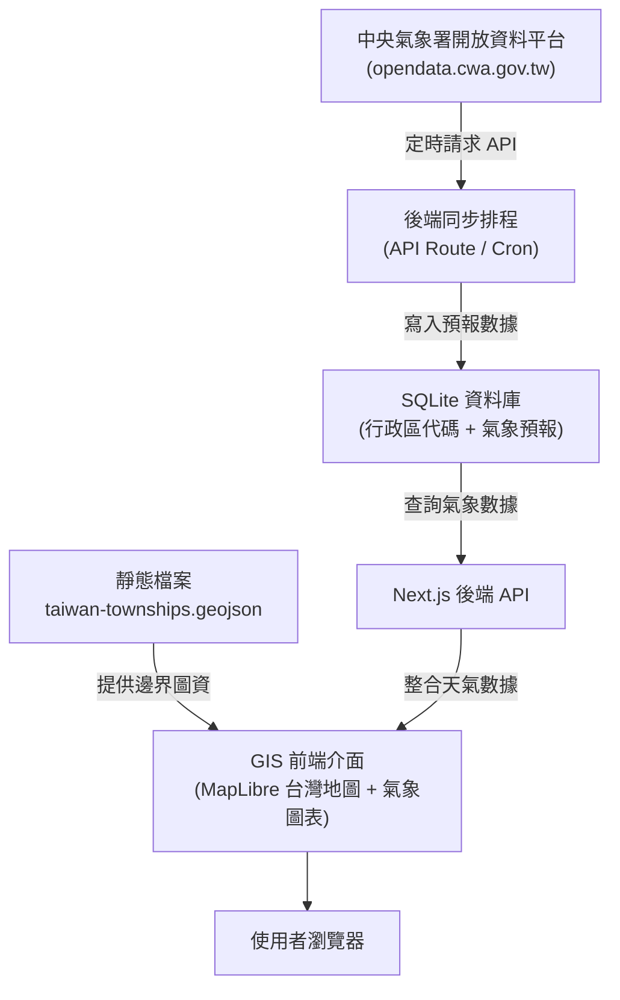

# 台灣氣象 GIS 平台：實作計畫

> 專案名稱：`taiwan-weather-gis`  
> 資料來源：[中央氣象署氣象資料開放平台](https://opendata.cwa.gov.tw/)  
> 目標部署：GitHub + Vercel（或本機/自建環境）  
> 資料庫選型：SQLite（輕量、免維運、極簡管理）  
> 開發原則：簡約、明確、好管理，專注於 CWA 開放資料與 GIS 地圖視覺化  

---

## 1. 專案目標

建立一個以台灣中央氣象署（CWA）開放資料為核心的互動式氣象 GIS 平台。

使用者應能：
- 依縣市、鄉鎮市區與時間查詢天氣。
- 在台灣 GIS 地圖上瀏覽行政區邊界與氣象圖層。
- 查看溫度、相對濕度、降雨機率等即時與預報數值。
- 查看時間序列預報趨勢圖表。
- 專案代碼透過 GitHub 進行版本控制與自動化測試部署。

---

## 2. 專案範圍

### 包含項目
1. **CWA 資料擷取**：後端排程請求 CWA API（https://opendata.cwa.gov.tw/），進行資料正規化與儲存。
2. **安全防護**：後端代理 API 請求，CWA API Key 不得暴露至前端或寫入公開儲存庫。
3. **資料儲存（SQLite）**：使用輕量 SQLite 儲存行政區資訊與氣象預報資料。地理邊界由前端靜態 GeoJSON 直接載入，免去空間資料庫（PostGIS）維運成本。
4. **台灣 GIS 地圖**：使用 MapLibre GL JS 呈現台灣縣市與鄉鎮地圖圖層，並與 SQLite 預報數據聯集展示。
5. **數據呈現**：在地圖與儀表板上視覺化呈現溫度、降雨機率、濕度與氣象圖表。
6. **版本控制與部署**：提交與推送到 GitHub，透過 GitHub Actions 進行驗證。

### 明確不包含（Out of Scope）
- 任何外部硬體感測器（如 ESP32、BME280、MQTT Broker）。
- 複雜機器學習與微氣候訓練模型。
- PostGIS 等重型空間資料庫伺服器。
- 會員系統或權限管理。

---

## 3. 核心技術棧

| 領域 | 技術選型 | 說明 |
|---|---|---|
| **Web 框架** | Next.js (App Router) + TypeScript | 伺服器端元件處理資料，地圖與圖表使用客戶端元件 |
| **GIS 地圖** | MapLibre GL JS | 輕量、開源、支援向量圖磚與靜態 GeoJSON 圖層 |
| **圖表** | Recharts 或 ECharts | 呈現未來時間序列溫度、降雨機率走勢 |
| **資料庫** | SQLite（如 `better-sqlite3` 或雲端 `libsql/turso`） | 極簡零維護，檔案型資料庫儲存氣象預報 |
| **資料驗證** | Zod | 驗證 CWA API 回應與內部 API 參數 |
| **版本控制 / CI** | Git + GitHub Actions | 每次推送自動執行 lint、typecheck 與測試 |

---

## 4. 系統架構



---

## 5. 建議專案目錄結構

```text
taiwan-weather-gis/
├── app/
│   ├── api/
│   │   ├── cron/cwa/route.ts       # CWA 資料定時同步端點
│   │   ├── health/route.ts         # 服務健康檢查
│   │   ├── map/temperature/route.ts# 地圖氣象圖層端點
│   │   └── weather/forecast/route.ts# 鄉鎮天氣預報端點
│   ├── layout.tsx
│   └── page.tsx                    # 主地圖儀表板
├── components/
│   ├── DistrictSelector.tsx        # 縣市/鄉鎮下拉選單
│   ├── LayerControl.tsx            # 地圖圖層切換開關
│   ├── WeatherChart.tsx            # 時間序列預報圖表
│   └── WeatherMap.tsx              # MapLibre 台灣 GIS 地圖
├── lib/
│   ├── cwa/
│   │   ├── client.ts               # 請求 CWA API Client
│   │   ├── normalize.ts            # CWA 資料清洗與正規化
│   │   ├── schema.ts               # Zod 型別驗證
│   │   └── types.ts
│   ├── db.ts                       # SQLite 資料庫連線實例
│   └── gis.ts                      # 行政區代碼與 GeoJSON 映射工具
├── db/
│   ├── schema.sql                  # SQLite 資料表結構檔
│   └── seed-districts.ts           # 台灣行政區基本代碼匯入腳本
├── public/geo/
│   └── taiwan-townships.geojson    # 台灣鄉鎮市區靜態幾何邊界
├── tests/
│   ├── fixtures/cwa-sample.json    # CWA 原始回應測試檔
│   └── unit/                       # 單元測試
├── .github/workflows/
│   └── ci.yml                      # GitHub Actions CI
├── .env.example                    # 環境變數範本
├── .gitignore                      # 排除 node_modules、.env 與 *.db
├── package.json
└── README.md
```

---

## 6. 資料來源與模型

### 6.1 中央氣象署 API
- **平台網址**：`https://opendata.cwa.gov.tw/`
- **主要資料集**：全臺灣各鄉鎮市區預報資料（例如 `F-D0047-093`）
- **核心欄位**：
  - 縣市（county）、鄉鎮市區（township）
  - 預報時間（startTime, endTime）
  - 氣溫（temperature）、最高溫（maxTemp）、最低溫（minTemp）
  - 相對濕度（humidity）、降雨機率（precipitationProbability）
  - 天氣狀況描述（weather, description）

### 6.2 SQLite 資料表結構

#### `locations`（行政區資訊）
```sql
CREATE TABLE IF NOT EXISTS locations (
    id TEXT PRIMARY KEY,
    code TEXT NOT NULL UNIQUE,     -- 官方行政區代碼（對應 GeoJSON 屬性）
    county TEXT NOT NULL,          -- 縣市名稱
    township TEXT NOT NULL,        -- 鄉鎮市區名稱
    created_at DATETIME DEFAULT CURRENT_TIMESTAMP
);
```

#### `cwa_forecasts`（氣象預報資料）
```sql
CREATE TABLE IF NOT EXISTS cwa_forecasts (
    id TEXT PRIMARY KEY,
    location_id TEXT NOT NULL REFERENCES locations(id),
    issued_at DATETIME NOT NULL,   -- CWA 發布時間
    start_time DATETIME NOT NULL,  -- 預報區間起點
    end_time DATETIME NOT NULL,    -- 預報區間終點
    temperature REAL,              -- 氣溫
    humidity REAL,                 -- 相對濕度
    pop REAL,                      -- 降雨機率 %
    weather_description TEXT,      -- 天氣狀況說明
    created_at DATETIME DEFAULT CURRENT_TIMESTAMP,
    UNIQUE(location_id, start_time, end_time)
);
```

---

## 7. 環境變數規範

`.env.example` 規格：
```dotenv
# CWA 開放資料平台 API Key（僅後端使用）
CWA_API_KEY=

# SQLite 本地路徑或連線字串
DATABASE_URL=file:./weather.db

# 資料同步端點防護 Secret
CRON_SECRET=

# 地圖底圖樣式網址
NEXT_PUBLIC_MAP_STYLE_URL=
```

> **安全準則**：真實金鑰只存在本機 `.env`，絕對禁止 commit 到 GitHub。此外 SQLite 實體檔案（`*.db`、`*.sqlite`）亦須列入 `.gitignore` 排除。

---

## 8. 分階段執行步驟

### Phase 0：環境初始化與 GitHub 設置
- [ ] 建立 Next.js + TypeScript 專案。
- [ ] 建立 `.gitignore`（確保排除 `.env*`、`*.db`、`node_modules`）與 `.env.example`。
- [ ] 建立 GitHub Actions CI 流程（lint、typecheck、test）。
- [ ] 建立健康檢查端點 `/api/health`。
- [ ] **提交初版並推送到 GitHub（Git commit & push）**。

### Phase 1：SQLite 基礎建設與行政區代碼
- [ ] 初始化 SQLite 資料庫與建立資料表結構（`schema.sql`）。
- [ ] 放置合法開源之台灣鄉鎮市區 GeoJSON 圖資於 `public/geo/`。
- [ ] 實作行政區基本代碼匯入腳本（建立代碼與 GeoJSON 映射）。
- [ ] **提交程式碼並推送到 GitHub**。

### Phase 2：請求 CWA API 與資料同步（CWA Ingestion）
- [ ] 查閱 https://opendata.cwa.gov.tw/ 官方 API 規範。
- [ ] 建立 typed CWA client，封裝 HTTP 請求與 API Key 認證。
- [ ] 實作 Zod schema 驗證 CWA 回傳資料結構。
- [ ] 實作資料清洗與 SQLite upsert 邏輯（依 location_id 與時間去重）。
- [ ] 建立受密鑰保護的同步端點 `/api/cron/cwa`。
- [ ] **提交程式碼並推送到 GitHub**。

### Phase 3：後端氣象查詢 API
- [ ] 實作 `/api/weather/forecast`：依行政區代碼取得時序預報。
- [ ] 實作 `/api/map/temperature`：取得地圖各行政區當前溫度資訊。
- [ ] 加入輸入參數檢查與錯誤處理。
- [ ] **提交程式碼並推送到 GitHub**。

### Phase 4：GIS 網頁開發與數據呈現
- [ ] 建立響應式儀表板介面（支援桌機與手機）。
- [ ] 整合 MapLibre GL JS 載入靜態台灣行政區邊界 GeoJSON。
- [ ] 實作氣象數據呈現：
  - 行政區依溫度區間填入色彩（Choropleth map）。
  - 滑鼠懸停/點擊行政區顯示即時天氣卡片。
- [ ] 加入縣市/鄉鎮下拉選單與圖層切換器（溫度/降雨機率）。
- [ ] 使用圖表呈現未來 24~72 小時預報趨勢。
- [ ] **提交程式碼並推送到 GitHub**。

### Phase 5：部署與驗收
- [ ] 設定部署環境與環境變數（`CWA_API_KEY`, `DATABASE_URL` 等）。
- [ ] 設定定時排程觸發 `/api/cron/cwa`。
- [ ] 完整測試端到端流程：CWA 擷取 ➔ SQLite 儲存 ➔ 前端地圖呈現。
- [ ] **完成最終 commit 與 push 至 GitHub main 分支**。

---

## 9. 驗收標準（Definition of Done）

- [ ] 使用者可透過下拉選單或點擊地圖選擇台灣任一鄉鎮市區。
- [ ] 台灣 GIS 地圖能正確渲染行政區邊界與氣象圖層（溫度/降雨機率）。
- [ ] 能清楚呈現即時與時序預報數據（含趨勢圖）。
- [ ] CWA API 請求正常運作，資料庫使用 SQLite 正常寫入與讀取。
- [ ] 金鑰與資料庫檔案未暴露於前端或 GitHub。
- [ ] 程式碼皆已提交並推送到 GitHub，CI 檢查全數通過。
- [ ] README 提供清晰的本機啟動步驟與環境變數設定說明。
