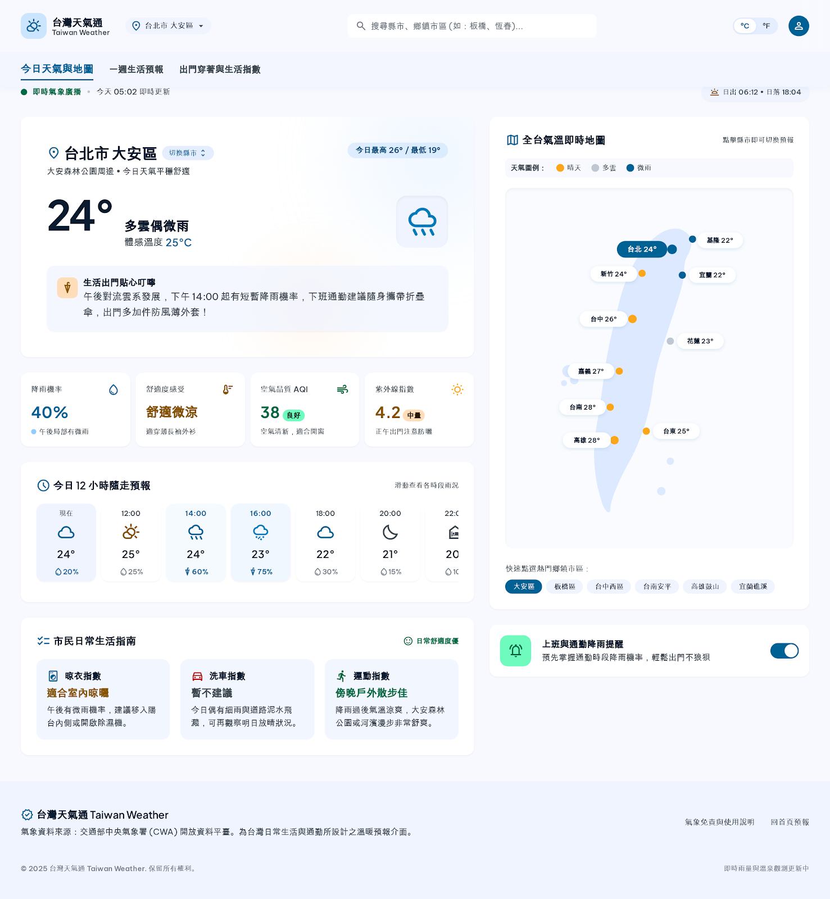

# 台灣氣象 GIS 平台 (Taiwan Weather GIS)

結合交通部中央氣象署（CWA）開放資料平臺與 GIS 互動地圖的台灣氣象生活儀表板。

---

## 🌐 線上展示 (Live Demo)



- **Live Demo 網址**：[https://taiwan-weather-gis.vercel.app](https://taiwan-weather-gis.vercel.app)

> **部署原則說明**：本專案包含動態後端 API 路由（`/api/weather`）與 SQLite 快取機制以保護 CWA API Key 不外洩，因此**嚴格不部署於僅支援純靜態網頁之 GitHub Pages**。推薦於 [Vercel](https://vercel.com/) 連結此 GitHub 儲存庫進行一鍵動態伺服器部署。

---

## 核心功能

1. **中央氣象署 CWA 資料同步**：即時串接 36 小時與一週預報資料（氣溫、降雨機率、舒適度、天氣現象）。
2. **SQLite 輕量快取層**：採用 Node.js 內建 SQLite 持久化快取，保護 API Key 並降低網路延遲。
3. **Google 地圖樣式 GIS 互動地圖**：
   - 支援完整台灣行政區定位、滑鼠拖曳、滾輪縮放。
   - 雙底圖模式：Google 街道底圖與高解析衛星混合空照圖。
   - 22 縣市即時氣溫浮動標記，點選立即聚焦並更新全站氣象數據。
4. **雙頁面生活儀表板**：
   - **今日天氣與互動地圖**：即時氣溫、體感溫度、12 小時時序預報、降雨機率、生活叮嚀。
   - **一週生活預報與走勢圖**：7 天天氣卡片、日夜氣溫平滑走勢圖、分段出門穿搭指南、生活指數 Bento。

---

## 本機快速啟動

### 1. 環境需求
- Node.js 20+（推薦 Node.js 22）
- npm 10+

### 2. 安裝依賴
```bash
npm install
```

### 3. 配置環境變數
建立 `.env` 檔案並填入中央氣象署 API Key：
```env
CWAKey=您的CWA金鑰
```

### 4. 啟動開發伺服器
```bash
npm run dev
```
瀏覽器開啟 `http://localhost:3000` 即可檢視。

### 5. 生產環境打包
```bash
npm run build
npm start
```